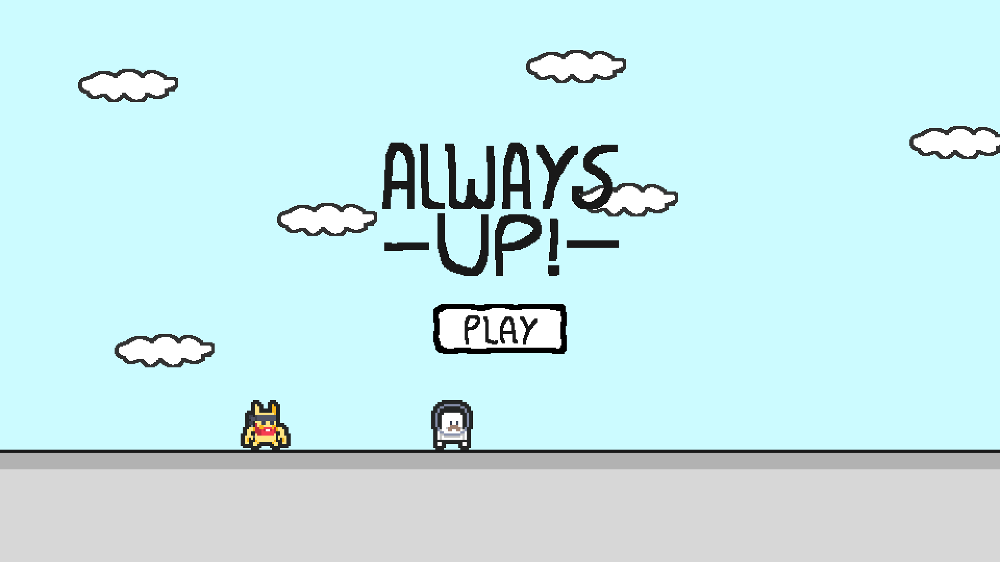

# Always Up! ☁️🕹️

🔗 **Jogue agora:** https://gx.games/games/5lm8a2/always-up-/tracks/f3d10d4e-c687-4c4d-904b-73bbc0aca1b4/

## Sobre o jogo

**Always Up!** é um jogo 2D de plataforma infinita onde o objetivo é simples: pular de nuvem em nuvem e subir o máximo que conseguir, sem cair. Quanto mais alto você vai, mais desafiador o caminho se torna, com obstáculos espalhados pelo cenário que podem te derrubar se você não desviar a tempo.

Não existe fim — só existe o seu recorde. A cada tentativa, o jogo registra sua pontuação mais alta (**HIGHEST**), te desafiando a superá-la na próxima subida.

## Como jogar

- **Objetivo:** suba o mais alto possível pulando entre as nuvens, evitando cair e evitando os obstáculos pelo caminho.
- **Pontuação:** aumenta conforme você sobe. Tente bater seu próprio recorde a cada partida.
- **Fim de jogo:** ao cair, sua altura final é comparada com o seu recorde salvo.

## Controles

### 💻 Computador
- Use as **setas do teclado** (ou **A/D**) para mover o personagem para os lados e **W** para pular.
- O personagem pula automaticamente ao tocar nas nuvens.

### 📱 Celular
- **Joystick virtual** na tela para mover o personagem lateralmente.
- **Botão de pulo** para saltar entre as plataformas.

## Sobre o desenvolvimento

Este jogo foi criado como parte de um **desafio de desenvolvimento em 24 horas** — do conceito à versão jogável, todo o jogo foi produzido em apenas um dia. A proposta era criar uma experiência simples, viciante e funcional tanto em desktop quanto em dispositivos móveis dentro desse curto prazo de tempo.

## Tecnologia

Jogo 2D com arte em pixel art, disponível para jogar diretamente no navegador através da plataforma **GX.games**, sem necessidade de instalação.

---

⬆️ Suba o mais alto que puder. Boa sorte!
